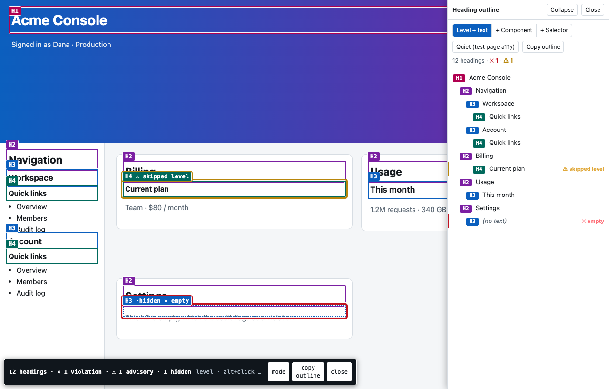
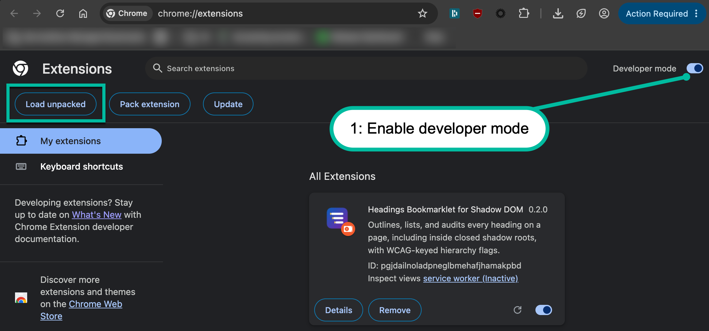
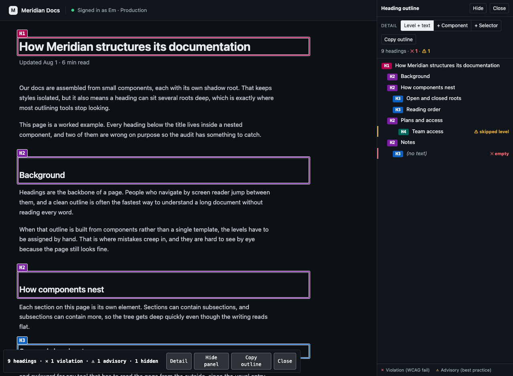
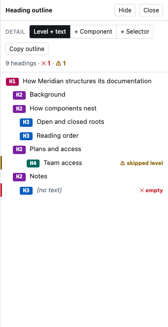

# Heading inspector for shadow DOM

This visual tool outlines, labels, lists, and performs accessibility checks for every heading on a webpage. It finds headings even when they're nested deep inside **open or closed** shadow roots, which is common for modern web applications.

Most heading extensions and bookmarklets stop at the first closed root, because a content script that reads `element.shadowRoot` gets `null` there.

This tool was designed with accessibility testers and engineers in mind, and is ideal for capturing heading structure details for defect reports, accessibility demos, and more.

The interface consists of:

- **On-page annotation**: a color-coded, labeled box around each heading, good for defect screenshots.
- **Sidebar**: a docked, keyboard-operable tree of the headings in reading order. Select a heading in the tree to scroll to it and flash it.
- **Hierarchy audit**: WCAG-keyed flags for empty headings, skipped levels, and missing or duplicate `h1`, split into WCAG violations and best-practice advisories.



## Try it without installing anything

- [Live demo](https://emilybarbenza.github.io/heading-inspector-for-shadow-dom/demo/standalone.html): a docs page built from nested shadow roots with two planted defects, tool already running.
- [Bookmarklet](https://emilybarbenza.github.io/heading-inspector-for-shadow-dom/bookmarklet.html): drag it to your bookmarks bar and run it on any page in any desktop browser. Open roots only, and the chip says so.

Closed shadow roots need the extension below.

## How to install

Get the code first, either way works:

- Download the extension zip from [Releases](https://github.com/emilybarbenza/heading-inspector-for-shadow-dom/releases) and unzip it somewhere permanent (not Downloads, since the browser loads it from that folder from then on), or
- Clone the repo and use its `extension/` folder.

### Chrome, Edge, Brave, Opera, Vivaldi

1. Navigate to `chrome://extensions`
2. Enable the **Developer mode** switch

   

3. Select the **Load unpacked** button
4. Select the `extension/` directory
5. Open the puzzle-piece menu and pin **Heading Inspector for Shadow DOM** so its icon
   is on the toolbar
6. Select the icon, or press `Alt+Shift+H`, to toggle it on a tab

To use it on a local file (`file://`), also open the extension's details and turn on
**Allow access to file URLs** — it's off by default, and without it the icon does
nothing on local pages. The extension shows a `!` badge with the reason whenever a
click can't do anything, which also covers browser pages and the extension galleries.

Load the extension through `chrome://extensions`, not the `--load-extension` command-line
switch: Chrome 137+ ignores unpacked extensions passed on the command line.

### Firefox

The same code works in Firefox, which has its own closed-root API the walker
already uses. One manifest serves both browsers (Chrome reads
`background.service_worker`, Firefox reads `background.scripts`).

1. Navigate to `about:debugging#/runtime/this-firefox`
2. Select **Load Temporary Add-on** and pick `extension/manifest.json`
3. Toggle it from the toolbar icon or `Alt+Shift+H`

Temporary add-ons unload when Firefox quits. A permanent install needs the
add-on signed through [addons.mozilla.org](https://addons.mozilla.org), which is
free; until it's published there, temporary loading is the way.

### Phones and tablets

Chrome extensions don't run on mobile, but **Firefox for Android** runs real
extensions, so the closed-root tool works there once it's on
addons.mozilla.org. Until then, the bookmarklet works in most mobile browsers
for open roots.

## How to use

Each heading gets an outlined box and a label.

| Encoding | Meaning |
| --- | --- |
| Solid border | Native `h1` to `h6` |
| Dashed border, `·aria` | Level came from `aria-level`, or the element is `role="heading"` |
| Dotted border, `·sr-only` | Clipped or parked off-canvas, but still in the accessibility tree and still announced |
| Border color | Level. It's redundant with the label text, so screenshots survive grayscale and CVD reviewers. |

Colors are white-on-color at 5.9:1 minimum. Every box and label carries a 1px white ring so it stays legible on dark backgrounds. That's what keeps a defect screenshot usable.

The chip at bottom-left leads with the number of headings in the outline, so it always equals the number of rows in the panel. Anything found but not listed is named with its reason after it — `4 headings · 2 display:none · 1 in aria-hidden` — and the parts add back up to every heading on the page. A heading is left out only when it isn't in the accessibility tree, which means one of: `display:none`, `visibility:hidden`, inside an `aria-hidden` or `inert` subtree, or behind an open modal. Nothing is ever left out for being scrolled out of view or drawn off-canvas.

| Key | Action |
| --- | --- |
| `Esc` | Hide the panel (boxes stay); press again, or with the panel already hidden, to close the whole tool |
| `Alt+Shift+M` | Cycle label detail: level, then owning component, then full chain |
| `Alt+Shift+C` | Copy the outline as indented text |
| `Alt+Shift+P` | Hide or show the outline panel. The boxes stay either way. |
| `Alt+Shift+D` | Cycle where the panel is docked: left, right, top, bottom, floating |
| `Alt`+click a box | Copy that heading's selector chain and console expression |

### Sidebar

A panel docks to the top document. **Dock** puts it against the left, right, top or bottom edge, or floats it — the same choices DevTools offers, for the same reason: a heading outline is tall and narrow on an article and wide and short on a dashboard, and the page you're auditing usually wants the opposite of whatever the tool wants. A floating panel drags by its header. Whichever edge it's on, the panel *overlays* the page rather than reflowing it, because reflowing would change the layout under audit. Position and size persist, so the tool comes back where you left it on the next page.

The resize handle is a real `separator`: `Tab` to it and the arrow keys resize (with `Shift` for larger steps), so the panel isn't pointer-only. It resizes along whichever axis its dock implies, and both axes when floating. The counts chip steps aside when a left or bottom dock would land on top of it.

Each heading is one row, indented by level, in reading order. The outline is a `tree`: `Tab` into it, then the arrow keys walk the headings (`Home`/`End` jump to the ends), and `Enter`/`Space` activates a row. Each row carries its heading level as `aria-level`. Activating a row scrolls that heading into view and pulses a highlight over it, across shadow boundaries, since `scrollIntoView` on the element works even inside a closed root.

The **Level + text / + Component / + Selector** control sets how much each row shows. It's a real `radiogroup`: one tab stop, arrow keys move and select, and it isn't conveyed by a hover tooltip since tooltips aren't accessible for that. The setting is shared with the overlay's `Alt+Shift+M` cycle, so the two surfaces never disagree, and it persists in `chrome.storage.local`.

Every control's tooltip shows on keyboard focus as well as hover (a native `title` only shows on hover, so keyboard users never saw it) and is wired with `aria-describedby` so a screen reader reads it too.

The panel is the one part of the tool that is *not* `aria-hidden`, because an auditor who uses a screen reader or the keyboard has to be able to drive it. The cost is that it adds a landmark and focus stops to the page under test while it's open, so to audit the page's own tab order or screen-reader output, close the tool (`Esc`) first. The panel and the counts chip are both top-frame only — with `allFrames` injection, a per-frame chip means a page with a visible iframe shows two bars at once, which reads as the tool rendering twice. Closing from the top frame takes the frames' boxes with it. Headings inside a *same-origin* iframe get boxed in place but aren't listed, since a sidebar inside every iframe would be silly. Cross-origin frames are a different matter: the tool asks to run in all frames, but `activeTab` grants host access for the tab's own origin only, so those frames are usually skipped entirely. The chip and the panel say how many are on the page, because silently auditing less than you appear to is the one thing an audit tool must never do. Open such a frame in its own tab to audit it.

The panel sits over the right edge of the page instead of reflowing it. That's on purpose, since reflowing would change the layout you're auditing. Resize it by dragging its inner edge, or hide it entirely while keeping the boxes with the header's Hide button, `Alt+Shift+P`, or the chip, and bring it back the same way.



*The panel follows the page's light or dark theme.*

### Hierarchy audit

Findings come in two tiers, since an auditor files one as a defect and the other as a note:

| Finding | Tier | Basis |
| --- | --- | --- |
| Empty heading (no perceivable accessible name) | **Violation** | WCAG 1.3.1 Info & Relationships (A), 2.4.6 Headings & Labels (AA); axe `empty-heading` |
| Skipped level (e.g. `h2` to `h4`) | Advisory | WCAG 1.3.1, technique G141; axe `heading-order`. Not a strict failure, but a standard audit finding. |
| No `h1` on the page | Advisory | Relates to 1.3.1 and 2.4.10 Section Headings (AAA); axe `page-has-heading-one` |
| More than one `h1` | Advisory | HTML allows it, but it weakens the top-level outline |
| First heading deeper than `h1` | Advisory | Advisory |

"Empty" is judged against an approximate accessible name, not raw text, so a heading named by `aria-label`, `aria-labelledby`, a captioned image, or `title` isn't a false positive. The hierarchy is computed over headings in the accessibility tree, which is the outline a screen-reader user actually navigates: `display:none`, `visibility:hidden`, `aria-hidden` and `inert` headings are out of the checks and out of the list, while screen-reader-only ones are in both. They're the headings that matter most on a visually heading-light design, and often the only structure there is.

When a modal dialog is open, the outline scopes to the dialog and says so. Everything behind a modal is unreachable to assistive tech — `showModal()` gets that from the top layer, `aria-modal="true"` claims it directly — so listing those headings would describe an outline nobody can navigate. Scoping also keeps the checks honest: a dialog is a section of the page, not a document of its own, so the page-level `h1` rules and "first heading deeper than `h1`" are suspended while it's open, and a dialog that correctly opens at `h2` isn't reported as a defect. Skipped levels *inside* the dialog are still flagged.

Violations get a heavier double-red ring on the box and a `✕` in the label and row. Advisories get a single amber ring and a `⚠`. The ring is redundant with the label text, so a grayscale or CVD screenshot still reads. The chip and the panel summary count each tier, and the copied record and copied outline cite the Success Criterion number and, where one exists, the equivalent axe rule.

These checks reimplement axe-core's heading rules (`empty-heading`, `heading-order`, `page-has-heading-one`) rather than bundling axe-core, on purpose. axe-core can't reach closed shadow roots (no page-world API can), so it would miss exactly the headings this tool exists to find, and it's ~550KB, which would blow the bookmarklet. Naming the equivalent rule in the output keeps the results interoperable with axe-based workflows.



### Label detail modes

```
H3
H3 <nav-bar>
H3 app-shell >>> nav-bar >>> h3.site-title
```

Class names inside shadow DOM are usually scoped noise, but the component tag maps to a file in the repo, so `<nav-bar>` is the token a developer greps for. Classes and id only show up in full-chain mode, and only on the leaf.

### The copied record

```
H3 (aria-level)
Regional breakdown
app-shell >>> nav-bar >>> h3.site-title
document.querySelector('app-shell').shadowRoot
  .querySelector('nav-bar').shadowRoot
  .querySelector('h3.site-title')
```

If the chain crosses a closed root, the record says so, because the console expression returns `null` in that case. The DevTools console doesn't have the extension's privileged access. The `>>>` chain is the durable form: Playwright pierces shadow DOM by default, and Puppeteer accepts `>>>`.

## Accessibility of the tool itself

- The annotation layer is `aria-hidden` and `pointer-events: none`. The chip is `aria-hidden` with `tabindex="-1"` buttons. Neither adds a tab stop or an accessibility-tree node, so an axe run or screen-reader pass with the overlay on stays clean.
- The sidebar panel is the deliberate exception. It *is* exposed and keyboard-operable, because the tool's own UI has to work for an auditor who uses assistive tech. So it adds a `complementary` landmark and focus stops while it's open. To audit the page's own keyboard order or screen-reader output, close the tool (`Esc`) first, then the page is clean again.
- Flag colors are theme-aware and clear WCAG AA (4.5:1) as text on both the light and dark panel: violation `#c1121f` / `#ff6b74`, advisory `#8a6300` / `#e0a83a`. The on-page rings sit against a 1px white halo and clear the 3:1 non-text bar, and they're redundant with the `✕`/`⚠` glyphs so color is never the only cue.
- The panel is theme-aware (`prefers-color-scheme`), so it's legible over light or dark pages without washing out a screenshot.
- `forced-color-adjust: none` on every box and label. Otherwise Windows High Contrast overrides `border-color` and flattens the level encoding.
- `prefers-reduced-motion` is respected: the jump-to highlight doesn't pulse and the scroll jumps instead of gliding.
- The panel caps its width on narrow viewports and the chip wraps instead of overflowing, so both stay usable on a phone-sized window.

## Privacy

No network requests. No `host_permissions`, no content scripts registered against any URL. The tool runs only in the tab you enable it from, and only when you enable the tool yourself. The one thing stored is your label-detail preference in `chrome.storage.local`. Nothing leaves the browser.

## Browser support

| Environment | API | Closed roots |
| --- | --- | --- |
| Chrome / Edge / Brave / Opera / Vivaldi extension | `chrome.dom.openOrClosedShadowRoot` | yes |
| Firefox extension (desktop and Android) | `Element.openOrClosedShadowRoot` | yes |
| Safari extension | none | **no** |
| Bookmarklet / page world (any browser) | `Element.shadowRoot` | **no** |

The chip prints `open roots only` whenever closed roots are out of reach. A heading tool that quietly under-reports is worse than no tool.

Safari would need a different approach: patch `Element.prototype.attachShadow` in the page's main world at `document_start` and record roots as they're created. That only catches roots created after injection, so it's a partial answer and should ship labeled that way.

## Bookmarklet

```
node build/build-bookmarklet.mjs
```

Writes `dist/bookmarklet.html` with a drag-to-install link. This exists because extension installs are blocked by policy in many government and finance environments, which is often exactly where accessibility testing is performed.

## Tests

```
npm ci && npx playwright install chromium firefox
npx playwright test
```

The page-world tests run on both real Chromium and real Firefox. The
extension-context test (six closed roots deep) is chromium-only, since
Playwright can't load a temporary add-on into Firefox.

`test/fixtures/deep-shadow.html` covers six closed roots nested one per level, open roots inside open roots, declarative shadow DOM, slotted headings that `textContent` can't see, `aria-level` overriding the tag, `role="heading"` with and without a level, `role="presentation"` on an `h3`, both sr-only recipes (a 1px clipped box and one parked at `left:-9999px`) plus `display:none` and `visibility:hidden` headings, `aria-hidden` and `inert` subtrees, a same-origin frame with its own closed root, and a heading appended after load.

`test/fixtures/scroll-pane.html` is the app-shell layout — fixed chrome, one `overflow:auto` pane, and a window that never scrolls. It exists because the outline must not change when the page scrolls, and this is the layout where it silently did.

`test/fixtures/modal.html` puts a `<dialog>` inside a shadow root, so modal detection has to go through the walker rather than a `querySelector`, which is where a real design-system dialog lives.

The fixtures are worth as much as the code. Existing extensions fail at four levels deep because nobody had a fixture that went four levels deep.

## Structure

`extension/walker.js` has no heading logic in it and is meant to be lifted out as a standalone package. It gives you composed-tree traversal, `closestFlattened` — a `closest` that crosses shadow boundaries, which `Element.closest` can't, and that follows `assignedSlot` so a slotted node is treated as living where it renders rather than where it's written — and a text resolver that expands `<slot>` to its assigned nodes. Every tool that needs to see into shadow DOM needs this part. The heading annotator on top of it is the simpler half.

## Known limitations

- Reading order is composed pre-order (host, then shadow content, then light children). Slotted light content is ordered at its light-DOM position, not its flattened slot position, so the outline order for slotted headings can differ from what's painted, and level-skip findings use that same order. It shows up most on dialogs: a title passed in as `<h2 slot="title">` is listed after the shadow-side headings even though it paints first. The heading is found and checked either way — only its position in the list can disagree with the page.
- The hierarchy checks include screen-reader-only headings, since they're in the accessibility tree, but they don't try to model reading order across same-origin iframes. Each frame is audited on its own, and only the top frame's headings show up in the sidebar.
- Screen-reader-only headings are detected by geometry (clipped to a ~1px box, or laid out past the document's edge), which covers the standard recipes but not every one. `text-indent:-9999px` in particular leaves an ordinary box behind and reads as a normal heading. It's still listed and still checked — only the `·sr-only` marker is missed.
- While a native `showModal()` dialog is open the tool relocates its own UI into the dialog, because the top layer paints above every `z-index` and inerts everything outside it — otherwise the boxes would be drawn under the dialog and the panel couldn't be clicked or focused. Being in the top layer is not enough on its own: a popover shown after the dialog is still inert in both Chromium and Gecko, so only a descendant of the dialog works. Two consequences. The hosts aren't reachable by `document.getElementById` while relocated, so use `window.__shadowHeadingOutliner.hosts` instead. And the tool briefly adds three nodes to the dialog's subtree, which a framework re-rendering that dialog may discard — the next scan puts them back.
- Modal detection covers `showModal()`, fullscreen elements, and `aria-modal="true"` on a dialog role. A hand-rolled modal that only *looks* modal — an overlay div with no `aria-modal` and no `inert` on the background — isn't detected, and correctly so: it doesn't actually take over the accessibility tree, and the background headings really are still reachable. If several modals are open at once, the outline scopes to the topmost.
- Selector chains aren't guaranteed unique. `querySelector` returns the first match at each hop.
- Capped at 3000 headings per frame, reported in the chip when it hits the cap. Dialogs don't count against that budget, so a page at the cap still scopes correctly to an open modal.
- A rescan runs on mutation, and on a 1.5s timer as a backstop. The timer is there because a custom element already present in the markup can be upgraded at any time: its `connectedCallback` attaches a shadow root and fills it, all inside a root nothing is observing yet, so no mutation fires anywhere. Design systems that load their definitions asynchronously do this on every page load.
- The boxes are positioned in document coordinates so they scroll with the page. A heading inside a `position:fixed` or `sticky` container can judder during active scrolling, since the box scrolls with the content and then snaps back to the fixed spot on the next redraw. Its resting position is correct.
- A full page navigation drops the overlay. Toggle it again. That's the cost of `activeTab` instead of blanket host permissions, which is the right trade for a tool that gets run against customer sites under a security review.
- The bookmarklet is around 56KB, under the ~64KB some non-Chromium browsers truncate at. The build fails (not warns) past 60KB, so growing out of the limit stops a release instead of silently shipping a truncated, syntactically broken bookmarklet. CSS comments are stripped from that build for the same reason — they'd be a couple of KB of prose inside a length-limited URL.

## License

[MIT](LICENSE). The shadow-piercing walker is meant to be lifted out and reused, and MIT is the least friction for that. Any project, including commercial ones, can embed it with only attribution.
